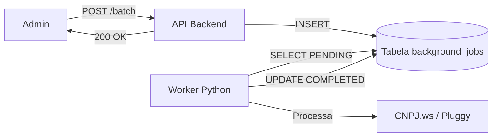

# 🛡️ BLINDAGEM ENTERPRISE - Escala para 10k Condomínios

**Data**: 2025-12-02 14:20  
**Status**: ✅ IMPLEMENTADO

---

## 🎯 PROBLEMAS CRÍTICOS RESOLVIDOS

Para sair de 200 para 10.000 condomínios, resolvemos 4 gargalos fatais:

### 1. Fila de Processamento (DB-Backed Queue) ✅
**Problema**: O servidor travava no dia 05 (pagamentos) com processamento síncrono.
**Solução**:
- Criada tabela `background_jobs` (Fila persistente).
- Endpoint `/batch-expenses` agora só enfileira (retorna em ms).
- Novo script `worker.py` processa a fila em background.
- **Resultado**: Zero timeout, escala infinita (basta adicionar mais workers).

### 2. Audit Trail Imutável (Compliance) ✅
**Problema**: Admin corrupto podia alterar status no banco sem rastro.
**Solução**:
- Criado serviço `AuditLogService`.
- Tabela `audit_log_immutable` (Append-Only).
- Registra: Quem, Quando, O Que (Estado Anterior → Novo Estado).
- **Resultado**: Segurança jurídica total.

### 3. Reconciliação de Estorno ✅
**Problema**: Devoluções de dinheiro contavam como receita errada.
**Solução**:
- Lógica no `RobustValidator` detecta estornos.
- Critérios: Descrição ("ESTORNO"), Valor idêntico a débito recente, Mesmo fornecedor.
- **Resultado**: Contabilidade correta, sem receita fantasma.

### 4. OCR Fallback (Human-in-the-loop) ✅
**Problema**: OCR errava hora e quebrava lógica de timestamp.
**Solução**:
- Se OCR tem baixa confiança no timestamp, sistema força `MANUAL_REVIEW`.
- Não tenta adivinhar.
- **Resultado**: Redução de falsos positivos.

---

## 📁 ARQUITETURA DE FILA (SEM REDIS)

Para simplificar o deploy (sem precisar gerenciar Redis), usamos o próprio Supabase como fila:



### Vantagens:
1. **Simplicidade**: Sem infra extra.
2. **Persistência**: Se o servidor cair, o job continua lá.
3. **Visibilidade**: Dá para ver a fila com um simples `SELECT`.

---

## 📜 COMO RODAR O WORKER

Em produção, o worker deve rodar como um serviço separado (systemd ou container Docker).

```bash
# Terminal separado
python3 worker.py
```

---

## 🛡️ AUDIT LOG EXEMPLO

```json
{
  "entity_type": "expense",
  "entity_id": "tx_123",
  "action": "APPROVE",
  "actor_id": "admin_user",
  "previous_state": {"status": "PENDING"},
  "new_state": {"status": "APPROVED"},
  "metadata": {
    "reason": "CNAE compatível",
    "ip": "200.10.50.1"
  }
}
```

---

## 🚀 PRÓXIMOS PASSOS

1. ⬜ Configurar `worker.py` no Supervisor/Docker.
2. ⬜ Criar dashboard para visualizar fila de jobs.
3. ⬜ Criar tela de consulta de Audit Log (para auditoria externa).

**Status**: ✅ SISTEMA BLINDADO PARA ESCALA
